# LifePulse — Hospital Management System

LifePulse is a multi-role hospital management platform built with **Blazor (Interactive Server)** and **ASP.NET Core**. It provides dedicated, role-based portals for **Admins**, **Doctors**, and **Patients**, backed by a REST API, a SQL Server database, and an AI-powered health assistant chatbot.

The system was built as a university project, with a focus on real-world architecture: a shared DTO layer, a clean separation between the API and the frontend, and secrets management via .NET User Secrets instead of hardcoded credentials.

---

## Table of Contents

- [Features](#features)
- [Tech Stack](#tech-stack)
- [Project Structure](#project-structure)
- [Screenshots](#screenshots)
- [MediBot — AI Booking Assistant](#medibot--ai-booking-assistant)
- [Getting Started](#getting-started)
- [Security Note](#security-note)
- [Authors](#authors)
- [License](#license)

---

## Features

### 🧑‍⚕️ Patient Portal
- Self-registration and secure login
- Book, view, and cancel appointments with available doctors
- View prescriptions issued by doctors
- View billing history and invoices
- Manage personal profile, including a profile photo
- Chat with **MediBot**, an AI-powered assistant that can answer hospital questions *and* book appointments for you in natural language (see [MediBot section](#medibot--ai-booking-assistant))

### 👨‍⚕️ Doctor Portal
- View appointments assigned by the admin
- Update appointment status (e.g. pending → completed)
- Add and manage prescriptions for patients

### 🛠️ Admin Portal
- Manage hospital departments
- Register new doctors, and activate/deactivate or edit existing doctor profiles
- Manage registered patients
- Process and track patient checkouts and billing
- View all appointments across the entire system

---

## Tech Stack

| Layer | Technology |
|---|---|
| UI | Blazor (Interactive Server), Bootstrap |
| Backend API | ASP.NET Core Web API (.NET 10) |
| ORM | Entity Framework Core 10 |
| Database | SQL Server (SQL Server Express supported) |
| API Documentation | Swagger / Swashbuckle |
| AI Chatbot | Groq API (`llama-3.3-70b-versatile`) |
| Shared Contracts | Class library (DTOs) shared between API and Blazor |

---

## Project Structure

```
LifePulse/
├── LifePulse.API/          # ASP.NET Core Web API
│   ├── Controllers/        # Auth, Admin, Patient, Chatbot controllers
│   └── Data/                # LifePulseDbContext (EF Core)
├── LifePulse.Blazor/       # Blazor frontend (Admin / Doctor / Patient portals)
│   └── Components/
│       ├── Pages/           # Razor pages per portal (Login, Dashboard, Appointments, etc.)
│       └── Layout/          # Shared layout components
├── LifePulse.Shared/       # Shared DTOs used by both API and Blazor
└── LifePulse.slnx          # Solution file
```

---

## Screenshots

### 🌐 Public Landing Page

| Hero Section | Services Overview | Our Doctors |
|---|---|---|
| 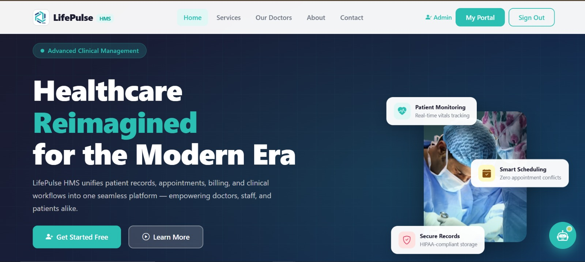 | 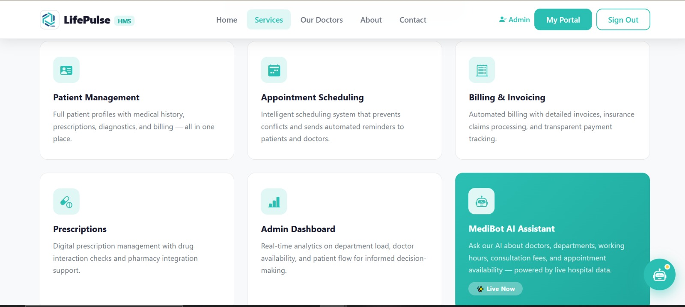 | 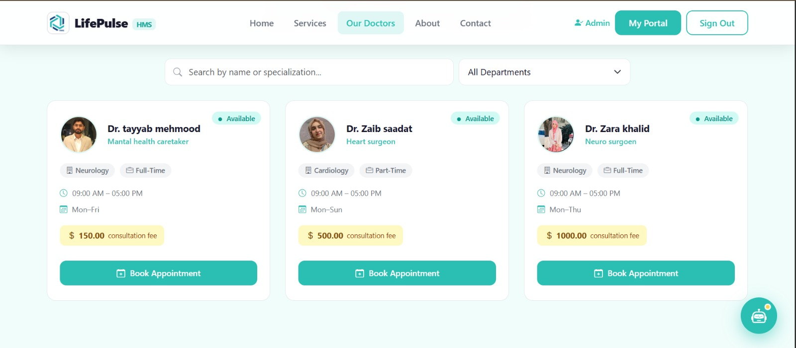 |

The landing page introduces LifePulse HMS, highlights core platform capabilities (patient management, scheduling, billing, prescriptions, admin analytics, and the **MediBot AI Assistant**), and lets visitors browse available doctors before signing in.

---

### 🧑‍⚕️ Patient Portal

| Dashboard | Book Appointment | Prescriptions |
|---|---|---|
| 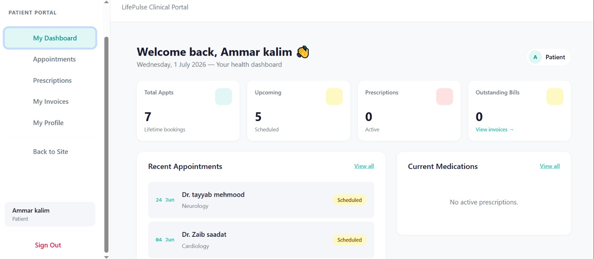 | 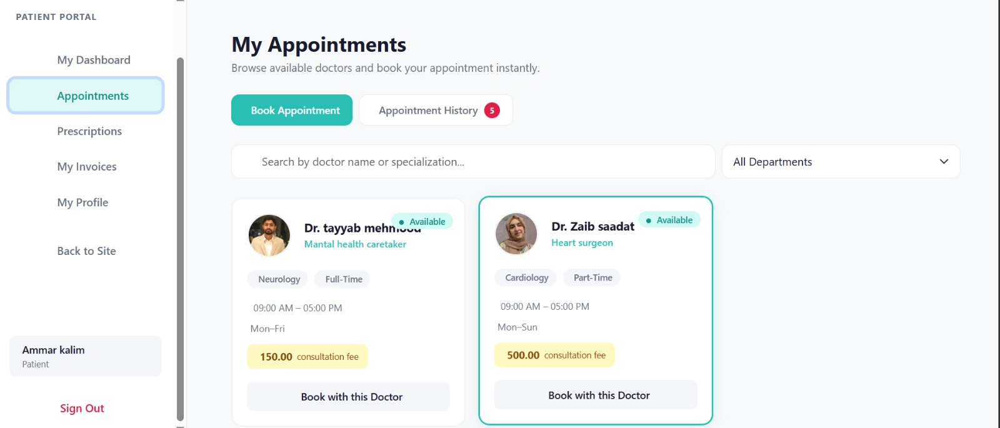 | 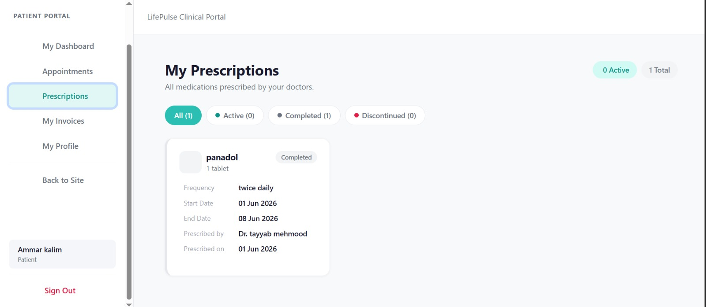 |

| Invoices & Billing | My Profile |
|---|---|
| 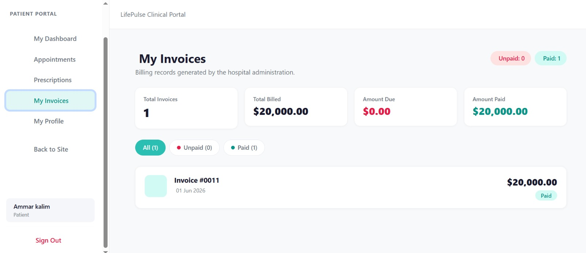 | 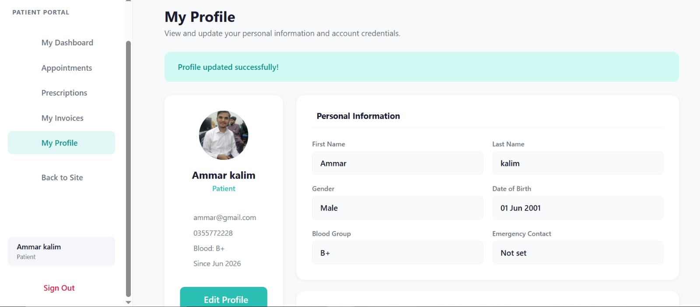 |

The patient dashboard gives an at-a-glance summary of appointments, prescriptions, and outstanding bills. Patients can search and book appointments by doctor or specialization, track prescription status (active/completed/discontinued), review itemized invoices, and manage their personal profile.

---

### 👨‍⚕️ Doctor Portal

| Doctor Profile | Daily Patient Roster & Prescription Pad |
|---|---|
| 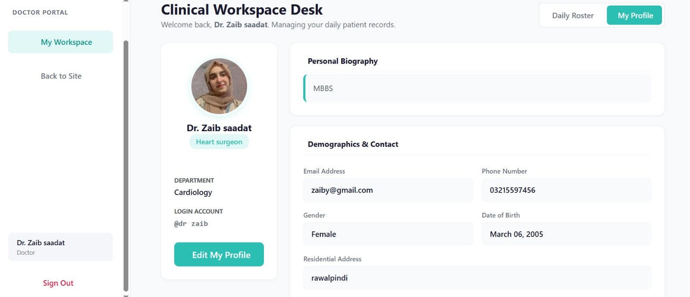 | 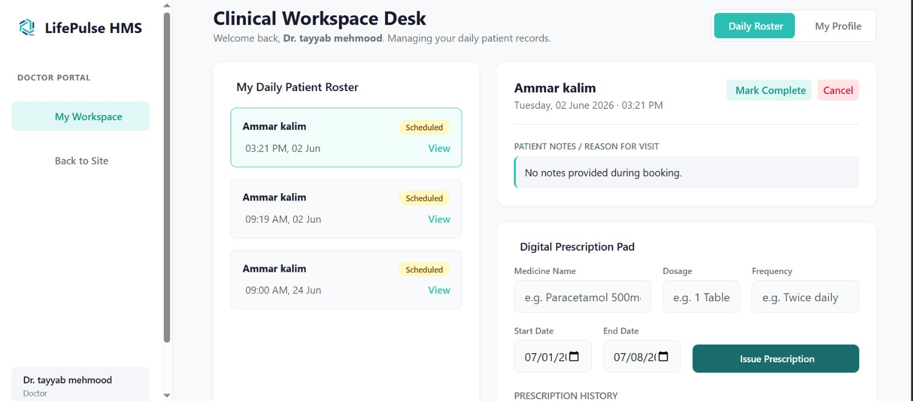 |

| Doctor Profile — Tayyab | Doctor Profile — Zara |
|---|---|
| 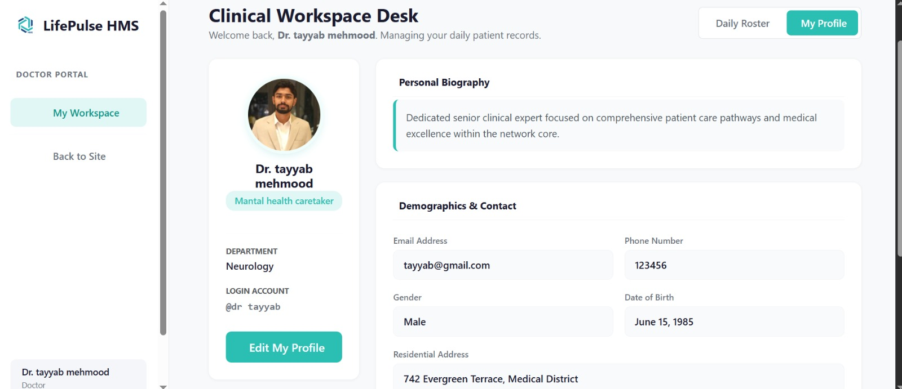 | 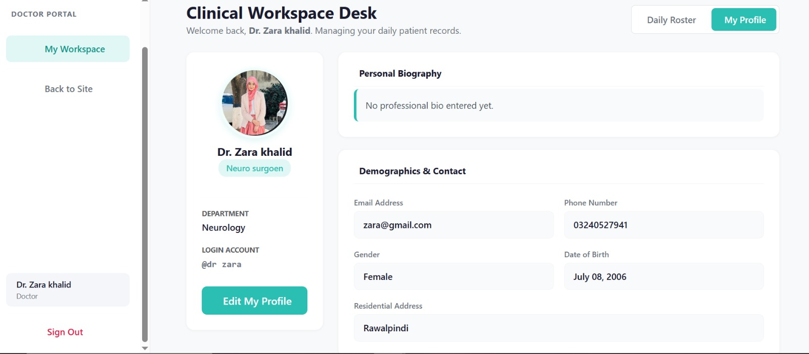 |

Each doctor manages their own clinical profile (biography, specialization, contact info) and works from a daily patient roster, where they can view appointment details, mark visits complete or cancel them, and issue digital prescriptions with dosage, frequency, and duration.

---

### 🛠️ Admin Portal

| Dashboard Overview | Doctors Management | Departments |
|---|---|---|
| 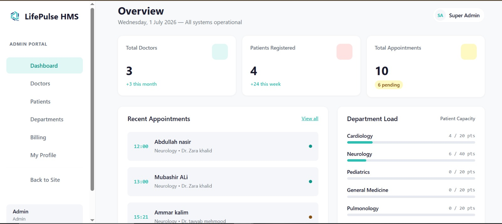 | 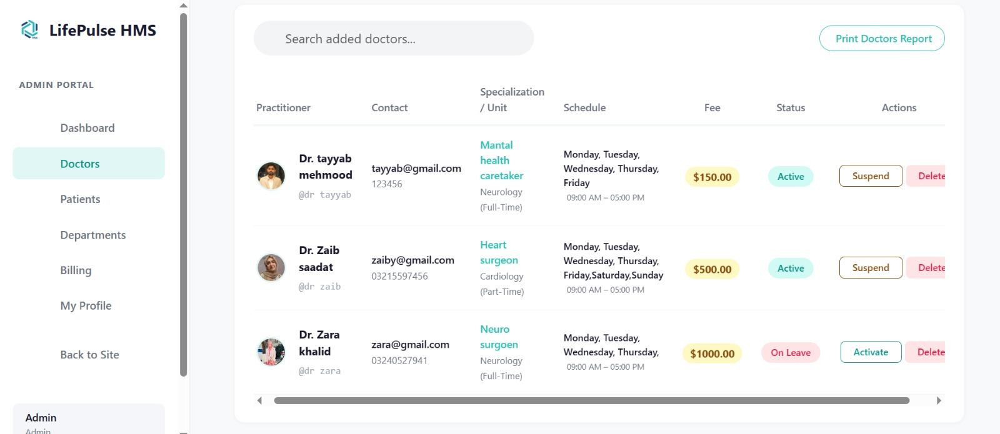 | 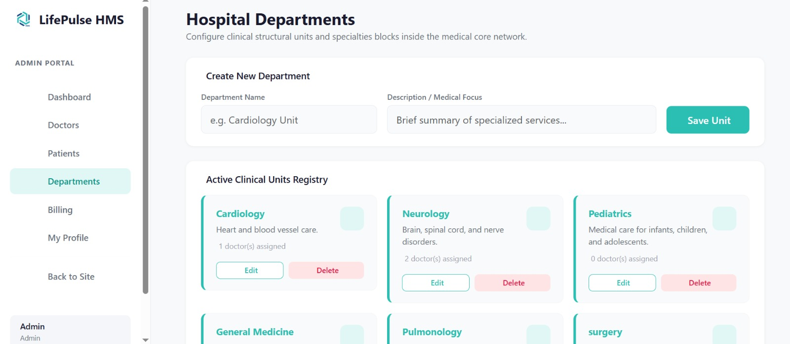 |

| Onboard New Doctor |
|---|
| 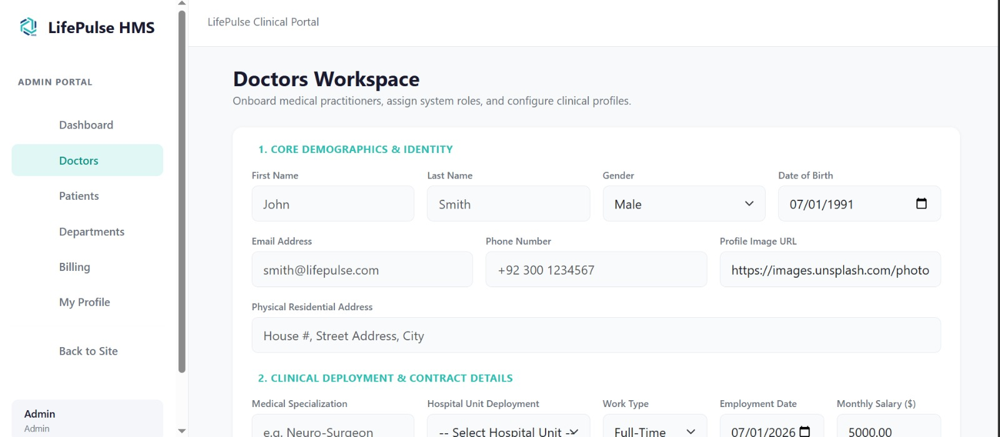 |

The admin dashboard surfaces hospital-wide metrics (total doctors, registered patients, appointments, department load) at a glance. Admins can onboard doctors with full demographic and clinical deployment details, manage department capacity, and activate/suspend or delete practitioner accounts — all from a centralized control panel.

---

## MediBot — AI Booking Assistant

LifePulse ships with **MediBot**, an AI assistant (powered by Groq's `llama-3.3-70b-versatile`) embedded as a floating chat widget across the platform. MediBot isn't just an FAQ bot — it's tied directly into live hospital data and can actually **complete actions on your behalf**, not just answer questions about them.

**What MediBot can do:**
- Answer questions about doctors, departments, specializations, working hours, and consultation fees — pulled from real-time hospital data, not static scripts
- **Book appointments through natural conversation.** Tell it something like *"book my appointment with Dr. Tayyab on Wednesday at 10 AM"*, and it validates the doctor's schedule and working hours, summarizes the appointment, and asks for confirmation before creating it
- Once you confirm, the appointment is created instantly and reflected in **My Appointments** and **My Dashboard** — no need to go fill out the booking form manually

> ⚠️ **Booking through MediBot requires you to be registered and logged in** as a patient. The assistant ties bookings to your authenticated account, so it knows who it's booking for and can validate against your existing appointments.

**Session persistence:** Once you log in, your session is stored and persists across page reloads and visits — you **don't need to log in again every time** to chat with MediBot or book appointments. You'll only be prompted to log in again once your session expires, so casual back-and-forth booking conversations stay smooth without repeated authentication interruptions.

| MediBot Greeting | Natural-Language Booking Request |
|---|---|
| 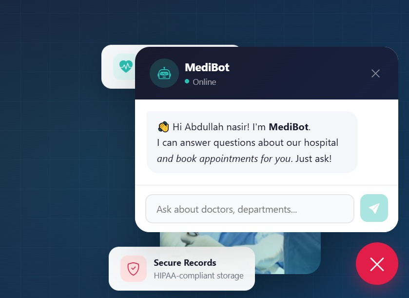 | 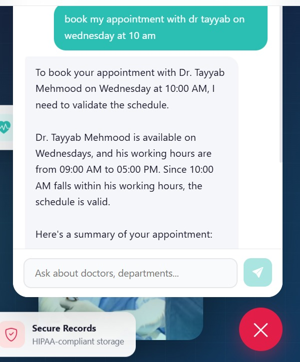 |

| Confirmation Step | Appointment Reflected on Dashboard |
|---|---|
| 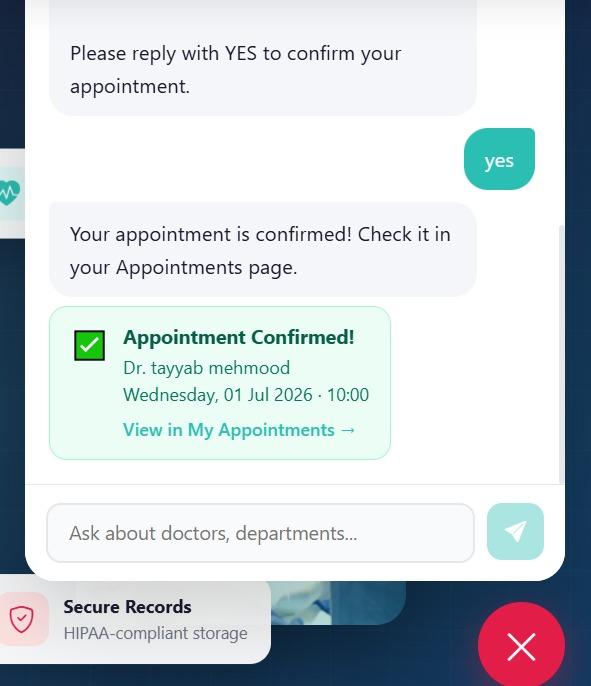 | 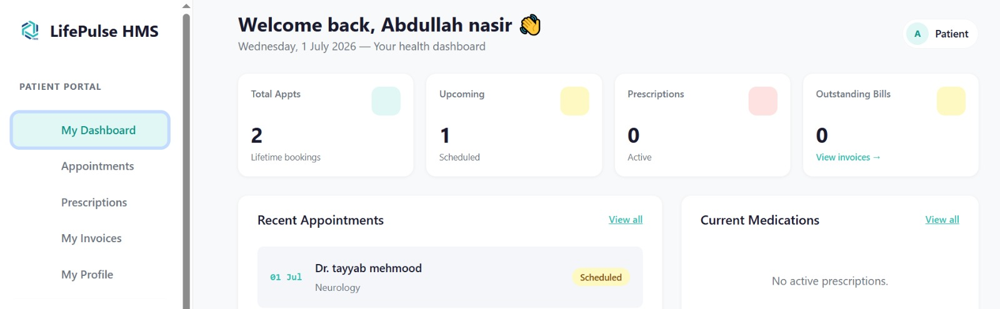 |

MediBot greets the logged-in patient by name, parses the natural-language request, cross-checks it against the doctor's actual availability and working hours, and asks for a final **YES** before committing the booking — after which the new appointment immediately shows up under **Recent Appointments** on the patient's dashboard.

---

### Prerequisites
- [.NET 10 SDK](https://dotnet.microsoft.com/download)
- SQL Server or SQL Server Express
- A free [Groq API key](https://console.groq.com/keys) (only needed for the chatbot feature)

### 1. Clone the repository

```bash
git clone https://github.com/Tayyab-Mehmood/Hospital-Management-System.git
cd Hospital-Management-System/LifePulse
```

### 2. Configure secrets

This project does **not** commit real connection strings or API keys. Configure them locally using .NET User Secrets:

```bash
cd LifePulse.API
dotnet user-secrets init
dotnet user-secrets set "ConnectionStrings:DefaultConnection" "Server=YOUR_SERVER\SQLEXPRESS;Database=LifePulseDb;Trusted_Connection=True;TrustServerCertificate=True;"
dotnet user-secrets set "GroqApiKey" "your-groq-api-key"
```

Alternatively, copy `appsettings.example.json` to `appsettings.json` inside `LifePulse.API/` and fill in your own values — just don't commit it.

### 3. Apply database migrations

```bash
cd LifePulse.API
dotnet ef database update
```

### 4. Run the application

```bash
dotnet run --project LifePulse.API
```

The API will start with Swagger UI available at `/swagger`. Run the Blazor project the same way (or set both `LifePulse.API` and `LifePulse.Blazor` as startup projects in Visual Studio) to use the full app.

---

## Security Note

`appsettings.json` in this repo intentionally excludes real credentials. **Never commit real connection strings or API keys** — use User Secrets locally, and environment variables or a proper secrets manager in production.

---

## Authors

**Tayyab Mehmood**
BS Computer Science, Air University, Islamabad

**Zaib Saadat**
BS Computer Science, Air University, Islamabad

---

## License

This project was built for academic purposes as part of a university course.
